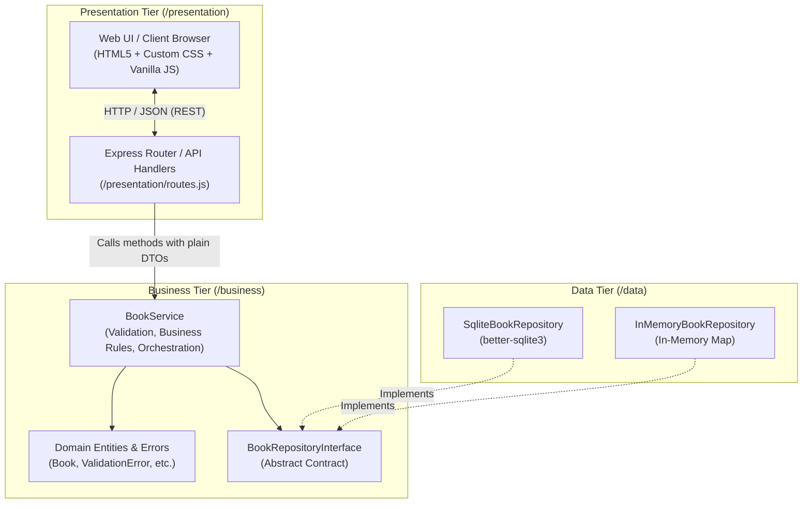

# Architecture & Data Flow Diagram

## 1. 3-Tier Architectural Overview

The application is decomposed into three strictly separated tiers to enforce **Separation of Concerns** and **Dependency Inversion**.



---

## 2. Tier Responsibility Matrix

| Tier | Folder | Allowed Responsibilities | Forbidden Responsibilities |
| :--- | :--- | :--- | :--- |
| **Presentation** | `/presentation` | HTTP request parsing, status code responses (`200`, `201`, `400`, `404`, `409`), serving static assets, rendering HTML/CSS/JS. | No business validation rules; no SQL queries or direct database access. |
| **Business Logic** | `/business` | Enforcing domain rules, input validation (non-empty fields, year bounds, ISBN checks, non-negative quantity), inventory checkout rules. | No HTTP/Express imports; no concrete database driver imports (strictly relies on `BookRepositoryInterface`). |
| **Data Access** | `/data` | Raw SQL / Map operations, executing CRUD operations, table schema management. | No business validations; no knowledge of HTTP or how data is formatted for users. |

---

## 3. End-to-End Request & Data Flow

```text
[ User clicks 'Check Out' in Browser UI ]
           │
           ▼
[ Presentation Tier: POST /api/books/:id/checkout ]
           │
           │ (Calls bookService.checkoutBook(id))
           ▼
[ Business Tier: BookService ]
    ├── 1. Fetches book via repository.getById(id)
    ├── 2. Checks Business Rule: Is book.quantity > 0?
    │       ├── NO  --> Throws InsufficientStockError
    │       └── YES --> Decrements book.quantity by 1
    └── 3. Calls repository.update(book)
           │
           │ (Executes SQL UPDATE)
           ▼
[ Data Tier: SqliteBookRepository ]
    └── Writes updated record to SQLite database and returns updated entity
           │
           ▼
[ Business Tier returns updated Book entity ]
           │
           ▼
[ Presentation Tier serializes Book to JSON & responds with HTTP 200 ]
           │
           ▼
[ Browser UI updates live counter badge & triggers success toast notification ]
```
